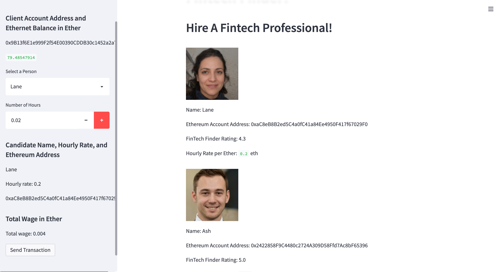
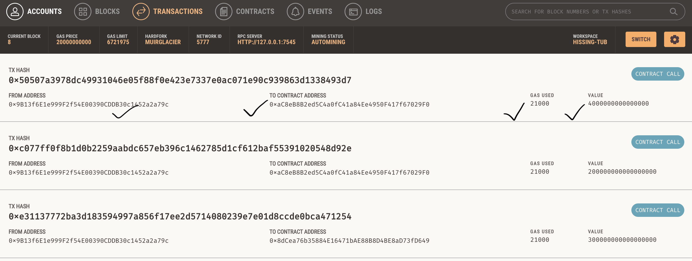
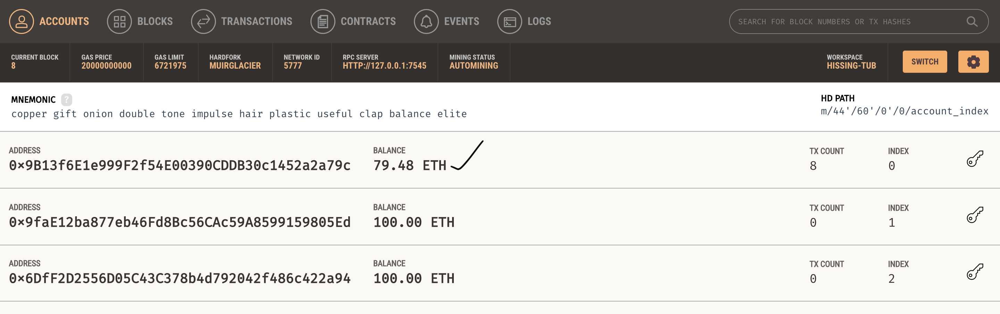

# Fintech Finder Crypto App
Application  integrated with Ethereum blockchain network that enables users to instantly pay with cryptocurrency.

## Overview:
Fintech Finder is an application integrated with ethereum blockchain network that works on Streamlit web interface, which can be used to find fintech professionals from among a list of candidates to hire, and pay them instantly with cryptocurrency.


## Application Design & process:

The application mainly works using Streamlit web interface, Ganache(ethereum blockchain network), Web3.py and bip44 library in python. 
The following ethereum transaction functions from `crypto_wallet.py` will be integrated with `fintech_finder.py` using import functionality in the latter:

#### * `generate_account()`- Generate a new Ethereum account instance by using your mnemonic seed phrase to create a digital wallet

* The mnemonic seed phrase needs to be added to the `.env` file. (Here it is provided by Ganache)
* This function will create the Fintech Finder customer’s HD wallet and Ethereum account.

#### * `get_balance()`- Fetch and display the account balance associated with your Ethereum account address.
    
* A new st.sidebar.write function (in fintech_finder.py) will display the balance of the customer’s account.
* Inside this function, get_balance function  is called and pass customer's Ethereum account.address.

#### * `send_transaction()`- Calculate the total value of an Ethereum transaction, including the gas estimate, that pays a Fintech Finder candidate for their work, Digitally sign a transaction and send this transaction to the Ganache blockchain.

* Customers will select a fintech professional from the application interface’s drop-down menu,and then input the amount of time for which they’ll hire the worker which will be multiplied by hourly rate of the candidate as provided in the candidate database in the application to arrive at `wage` (total ether) to be paid.
* Next, send_transaction function is passed `customer's address`(using account.address), `receiver's address` (candidate_address picked from the candidate database)and `wage` value for `from`, `to` and  `toWei` attributes.
* This function returns and saves transaction hash as variable named `transaction_hash` and displays the same on web inetrface.
     

## Usage:
Steps to be followed:
1. To run the application, open terminal, activate conda dev environment, change directory to application directory and type streamlit run fintech_finder.py.
2. On the resulting webpage, select a candidate using the appropriate drop-down menu. Then, enter the number of hours that one would like to hire them for.
3. Click the Send Transaction button to sign and send the transaction with your Ethereum account information. The webpage should should show transaction hash for the transaction. Also, the transaction can be verified after navigating to Account and Transactions sections of Ganache.
  
  
## Testing and Transactions:

### Web application working:




### Transaction hash:


### Transaction in Ganache:




### Account in Ganache after transaction:




## Technologies

This application leverages python 3.7 with the following modules:

* `streamlit`- An open source app framework in Python language. It helps us create web apps 
* `Ganache` - A personal blockchain for rapid Ethereum application development and testing Apps
* `web3`-  A Python library for interacting with Ethereum used for apps (dapps) to help with sending transactions, interacting with smart contracts etc. 
* `bip44`- A BIP procedure used to converts the seed phrase to a corresponding private key that we can use to authorize transactions on a blockchain network.
* `os`- A Python provides functions for interacting with the operating system
* `dotenv`- A Python-dotenv reads key-value pairs from a .env file and can set them as environment variables


## Installation Guide

```
pip install streamlit
pip install web3
pip install bip44

```

Ganache Installation, Click[Here](https://trufflesuite.com/docs/ganache/quickstart/)

## Contributor

Shivangi Gupta

## License

MIT